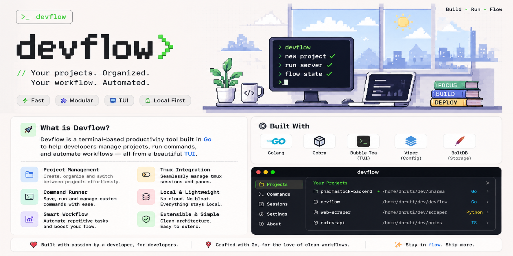
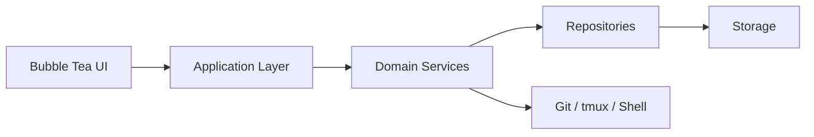
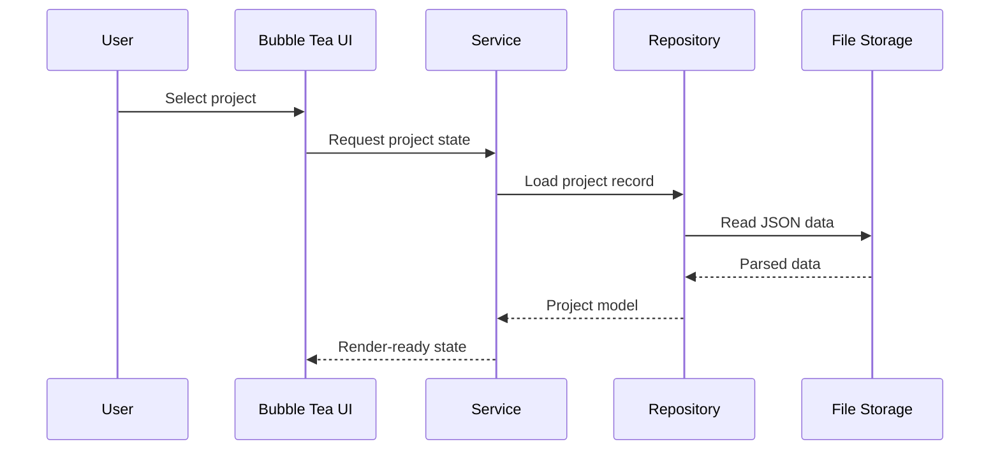

# DevFlow Workspace Orchestrator



DevFlow is a terminal-first workspace manager that unifies project registration, command execution, tmux sessions, Git inspection, and workflow orchestration in a single Bubble Tea application.

It is built as a local-first tool for organizing development environments from the terminal, with explicit separation between UI, services, repositories, and storage.

## Architecture At A Glance





## What DevFlow Solves

Modern development work is fragmented across terminals, Git, tmux, editors, and scripts. DevFlow centralizes the common workspace actions in one interface.

With DevFlow, you can:

- Register and organize local projects in a persistent registry
- Launch predefined commands per project
- Inspect Git status and repository metadata
- Restore and manage tmux sessions
- Search projects by name, stack, tags, and favorites
- Keep workspace preferences in a simple configuration system

## Current Scope

### Project Registry

Store project metadata such as name, description, local path, stack, tags, favorite status, Git support, saved commands, and timestamps.

### Interactive Dashboard

Use a terminal UI to browse projects and surface repository context such as branch, working tree status, favorites, and recent activity.

### Command Runner

Save and execute project commands like `go test ./...`, `npm run dev`, or `make migrate`, with streamed output in the terminal interface.

### Git Integration

Track repository context such as branch, status, recent commits, and ahead/behind information.

### tmux Integration

Create, restore, and attach to sessions so a project can recreate its terminal layout and working environment consistently.

### Search and Filters

Find projects by name, technology, or tags, and narrow results with favorites, recently opened projects, and stack-based filters.

### Configuration and Persistence

Start with JSON storage and a compact config file for user preferences.

## Technology Stack

- Go for concurrency, portability, and a small runtime footprint
- Bubble Tea for event-driven terminal UI state management
- Lip Gloss for styling, borders, layout, and responsive components
- Viper for configuration loading and environment support
- JSON for persistence

## Code Tree

```text
cmd/
	devflow/
		main.go

internal/
	config/
		config.go
		config_test.go
	projects/
		commands.go
		models.go
		repository.go
		service.go
		storage.go
		validator.go
	runner/
		runner.go

devflow.png
devflow.yaml
README.md
LICENSE
docs/
	system-design.md
	architecture.md
```

## Documentation

The detailed design and architecture notes live in the docs folder:

- [System Design](docs/system-design.md)
- [Architecture](docs/architecture.md)

## Principles

- Terminal-first UX
- Local-first storage
- Modular architecture
- Separation of UI and business logic
- Service-oriented internal modules
- Extensible, plugin-ready design
- Explicit error handling
- Lightweight runtime
- Cross-platform compatibility

## License

DevFlow is released under the MIT License. See [LICENSE](LICENSE) for details.
