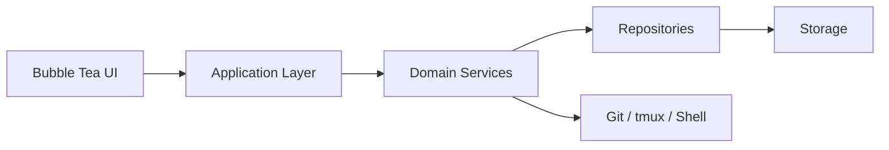
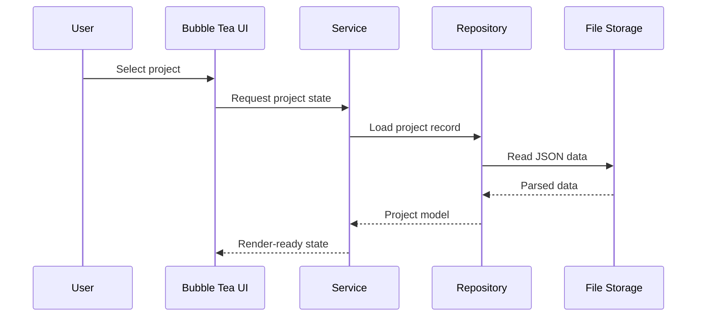

# DevFlow Workspace Orchestrator


DevFlow is a terminal-first workspace manager that unifies project registration, command execution, tmux sessions, Git inspection, and workflow orchestration in a single Bubble Tea application.

It is built as a local-first tool for organizing development environments from the terminal, with explicit separation between UI, services, repositories, and storage.

## Architecture At A Glance





## What DevFlow Solves

Modern development work is fragmented across terminals, Git, tmux, editors, and scripts. DevFlow centralizes the common workspace actions in one interface.

With DevFlow, you can:

- Register and organize local projects in a persistent registry
- Launch predefined commands per project
- Inspect Git status and repository metadata
- Restore and manage tmux sessions
- Search projects by name, stack, tags, and favorites
- Keep workspace preferences in a simple configuration system

## Current Scope

Status is tracked in detail in [docs/system-design.md](docs/system-design.md#implementation-status); the summary below reflects that table.

### Project Registry — Done

Store project metadata such as name, description, local path, stack, tags, favorite status, Git support, saved commands, and timestamps. Implemented in `internal/project`.

### Command Runner — Done

Save and execute project commands like `go test ./...`, `npm run dev`, or `make migrate`, with streamed output captured per process. Implemented in `internal/runner`.

### Docker Awareness — Planned (next)

Detect whether a project has a `Dockerfile` or docker-compose setup, run default or custom docker/compose commands, and view that project's containers and images without leaving DevFlow. See `internal/docker` in the target layout below.

### Git Integration — Not started

Track repository context such as branch, status, recent commits, and ahead/behind information.

### tmux Integration — Not started

Create, restore, and attach to sessions so a project can recreate its terminal layout and working environment consistently.

### Interactive Dashboard & Search — Not started

A terminal UI to browse, search, and filter projects (by name, technology, tags, favorites, recently opened) and surface Git/Docker context at a glance. Depends on the application and UI layers.

### Configuration and Persistence — Partial

JSON storage and a compact YAML config file are in place (`internal/config`); theme/shell/editor preferences are not yet surfaced.

## Technology Stack

- Go for concurrency, portability, and a small runtime footprint
- Bubble Tea for event-driven terminal UI state management
- Lip Gloss for styling, borders, layout, and responsive components
- YAML (`gopkg.in/yaml.v3`) for configuration loading
- JSON for persistence

## Code Tree

DevFlow is organized domain-first: each capability (`project`, and soon
`docker`, `git`, `tmux`) owns its model, logic, and tests in one package,
rather than being split across generic `models/`/`services/`/`storage/`
layers. See [docs/architecture.md](docs/architecture.md) for the full
rationale.

```text
cmd/
	devflow/
		main.go

internal/
	config/                 # shared infra: YAML config loading
		config.go
		config_test.go
	runner/                 # shared infra: tracked shell process execution
		runner.go
		runner_test.go
	project/                # domain: registry, commands, validation, storage
		commands.go
		models.go
		repository.go
		service.go
		storage.go
		validator.go
	data/
		projects.json       # local runtime project registry (not seed data)

devflow.png
devflow.yaml
README.md
LICENSE
docs/
	system-design.md
	architecture.md
```

## Documentation

The detailed design and architecture notes live in the docs folder:

- [System Design](docs/system-design.md)
- [Architecture](docs/architecture.md)

## Principles

- Terminal-first UX
- Local-first storage
- Modular architecture
- Separation of UI and business logic
- Service-oriented internal modules
- Extensible, plugin-ready design
- Explicit error handling
- Lightweight runtime
- Cross-platform compatibility

## License

DevFlow is released under the MIT License. See [LICENSE](LICENSE) for details.
