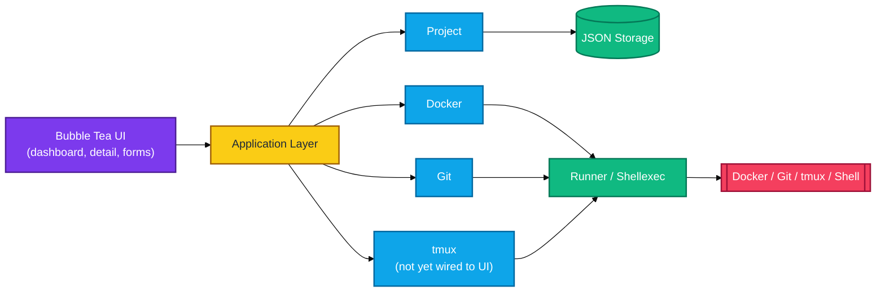
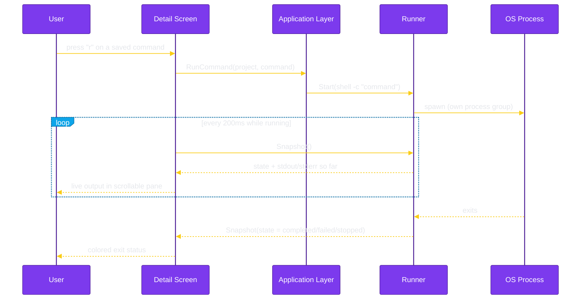

# DevFlow Workspace Orchestrator


DevFlow is a terminal-first workspace manager that unifies project registration, saved-command execution with live streamed output, Docker awareness, and Git inspection in a single Bubble Tea application.

It is built as a local-first tool for organizing development environments from the terminal: no database, no background service, no network calls — a JSON registry on disk and a handful of CLI tools (`git`, `docker`) it shells out to only when a project actually needs them.

## Features

- **Project Registry** — register, edit, favorite, and delete local projects (name, description, tech stack, path), with duplicate-path registration rejected so the same directory can't end up as two ambiguous entries.
- **Saved Commands, Run Live** — save reusable shell commands per project (`go test ./...`, `npm run dev`, `make migrate`, ...) and run them from the TUI: stdout/stderr stream live into a scrollable pane, a colored exit status (completed/failed/stopped) appears when it finishes, and a run can be stopped early — the whole process tree is killed, not just the top-level shell.
- **Docker Awareness** — auto-detects a `Dockerfile`/compose setup, derives a Docker identifier for scoping CLI queries, generates default docker/compose commands, and shows the project's own containers (colored by running state) and images.
- **Git Awareness** — live branch, clean/dirty status (staged/unstaged/untracked counts), and ahead/behind tracking, parsed directly from `git status`/`git log` output — no Git library dependency.
- **Sidebar Project Detail View** — Overview / Commands / Git / Docker as separate sections behind a sidebar, so nothing gets pushed off-screen on a smaller terminal, with a footer legend that always reflects exactly what the current section supports.
- **Bubble Tea Terminal UI** — a gradient block-letter splash screen, a bordered-panel dashboard, and directory-picker-driven add/edit forms, all sharing one violet/yellow theme.
- **Zero-Config by Default** — a single optional `devflow.yaml` for storage path and runner shell; DevFlow runs out of the box without one.

**Not yet built:** search/filtering in the dashboard, and a tmux session view in the TUI (the `internal/tmux` package itself — create/list/kill/attach — is implemented and tested, just not wired into any screen yet).

## Architecture At a Glance





See [docs/architecture.md](docs/architecture.md) for the full package-level breakdown and [docs/system-design.md](docs/system-design.md) for the product vision and implementation status.

## Prerequisites

- **Go 1.26+** (matches the toolchain pinned in `go.mod`) — DevFlow is a single Go module with no other required runtime.
- **A POSIX shell** (`sh` by default, configurable via `devflow.yaml`) — used to run saved commands; already present on macOS and Linux.
- **`git`** *(optional, recommended)* — powers the Git section of the project detail view. Without it on `PATH`, that section just reports "Not a Git repository."
- **`docker`** *(optional)* — powers the Docker section for projects that have a `Dockerfile` or compose file. Projects without Docker configured are unaffected either way.
- `tmux` is **not required** today: `internal/tmux` exists and is tested, but no screen calls into it yet.

## Getting Started

```bash
git clone https://github.com/swaindhruti/devflow-workspace-orchestrator.git
cd devflow-workspace-orchestrator
go run ./cmd/devflow
```

Or build a binary:

```bash
go build -o devflow ./cmd/devflow
./devflow
```

On first run with an empty registry, the dashboard shows "No projects yet" — press `a` to register your first project via the directory picker.

### Configuration

DevFlow looks for `devflow.yaml` in the current working directory at startup:

```yaml
storage:
  path: "internal/data/projects.json"

runner:
  shell: "sh"
  timeout: "0"
```

- `storage.path` — where the project registry JSON file lives.
- `runner.shell` — the shell saved commands run through (`<shell> -c "<command>"`).
- `runner.timeout` — accepted for forward compatibility; not yet enforced by the runner.

If no `devflow.yaml` is found, DevFlow falls back to built-in defaults — a registry at `~/.devflow/projects.json` and `sh` as the shell — so it runs with zero required configuration. The repository's own `devflow.yaml` keeps the registry inside the repo, which is convenient for local development; run DevFlow from the repository root to pick it up, or remove/relocate that file to use the `~/.devflow` default instead.

### Keybindings

| Screen | Key | Action |
| --- | --- | --- |
| Dashboard | `↑/k` `↓/j` | Move selection |
| Dashboard | `enter` | Open project detail |
| Dashboard | `a` | Add a project |
| Dashboard | `e` | Edit the selected project |
| Dashboard | `f` | Toggle favorite |
| Dashboard | `d` | Delete (y/n confirm) |
| Dashboard | `q` | Quit |
| Add/Edit — browse step | `↑/k` `↓/j`, `enter/l`, `h/esc` | Move, open a directory, go up a directory |
| Add/Edit — browse step | `s` | Choose the current directory |
| Add/Edit — details step | `tab`/`shift+tab`, `enter` | Move between fields, or submit on the last one |
| Add/Edit | `esc` | Cancel |
| Detail — any section | `←/→`, `h/l`, `tab`/`shift+tab` | Switch section (Overview / Commands / Git / Docker) |
| Detail — Commands | `↑/k` `↓/j` | Select a command |
| Detail — Commands | `a` | Add a command |
| Detail — Commands | `d` | Delete the selected command (y/n confirm) |
| Detail — Commands | `r` | Run the selected command |
| Detail — Running | `↑/k` `↓/j` | Scroll output |
| Detail — Running | `s` | Stop the run without leaving the pane |
| Detail — Running | `esc` | Stop (if still running) and return to Commands |
| Any screen | `ctrl+c` | Quit immediately |

## What DevFlow Solves

Modern development work is fragmented across terminals, Git, Docker, and scripts. DevFlow centralizes the common workspace actions — registering a project, running its commands, checking its Git/Docker state — in one interface instead of a dozen scattered terminal tabs.

## Current Scope

Status is tracked in detail in [docs/system-design.md](docs/system-design.md#implementation-status); the summary below reflects that table.

### Project Registry — Done

Store project metadata such as name, description, local path, stack, tags, favorite status, Git support, saved commands, and timestamps. Implemented in `internal/project`. `Service.AddProject` rejects registering a second project at a path that's already registered, so the same directory can't end up as two ambiguous registry entries.

### Command Runner — Done

Save and execute project commands like `go test ./...`, `npm run dev`, or `make migrate`, as tracked processes with streamed output captured per process. Implemented in `internal/runner`, which starts every command as the leader of its own process group so stopping it tears down the whole process tree — not just the top-level shell — since a shell command commonly forks children (a backgrounded job, `npm run dev` spawning node, ...) that a plain kill of the shell alone would otherwise orphan.

### Docker Awareness — Done

Detects whether a project has a `Dockerfile` or docker-compose setup, derives a Docker identifier for scoping CLI queries (Compose's own project-name convention, or a manual override for plain-`Dockerfile` projects), generates default docker/compose commands (`up`, `down`, `build`, `restart`, `logs`, or `build`/`run` without compose), and inspects that project's containers and images. Implemented in `internal/docker`, executed through `internal/runner`, and built on the `internal/shellexec` CLI abstraction. Surfaced in the TUI via the project detail screen's Docker section.

### Git Integration — Done

Reads current branch, working tree status (staged/unstaged/untracked counts, a clean flag), ahead/behind tracking, and recent commit history, by parsing `git status --porcelain=v2 --branch` and `git log --oneline` directly (no Git library dependency). Implemented in `internal/git`, built on `internal/shellexec`. Surfaced in the TUI via the project detail screen's Git section.

### tmux Integration — Library Done, UI Not Wired Yet

Creates, lists, and kills tmux sessions per project, and checks whether one already exists, by invoking the `tmux` CLI. Implemented in `internal/tmux`, built on `internal/shellexec`. Interactively attaching to a session hands the real terminal over to the tmux client for the session's lifetime, which the capture-based executor abstraction cannot represent — `tmux.AttachArgs` returns the literal command for a future UI layer to exec directly against the terminal, once that layer exists. No screen calls into this package yet.

### Application Layer — Done

The composition root wiring project, docker, git, and tmux together, plus the cross-domain operations no single domain package should perform itself: registering a project and auto-detecting its Docker setup in one call, aggregating a project's live Git status and Docker containers/images into one read, and routing a saved command to the right executor (plain or Docker) regardless of which domain it belongs to, plus stopping a running one by ID. Implemented in `internal/app`; `cmd/devflow` runs through it end to end instead of wiring services by hand.

### Interactive Dashboard & Project Detail — Partial

`cmd/devflow` is the real Bubble Tea entrypoint: a splash screen shows a purple-to-yellow gradient block-letter "DEVFLOW" banner (`internal/ui/banner`), a tagline, and — once the terminal is large enough — a distinctly-designed, named, static block-art mascot in each of the four corners: GitMaster (git), Dockzilla (docker), PaneMan (tmux), and ProjectPal (projects), each with its own shape and color, then hands off on keypress to the project dashboard (`internal/ui/dashboard`): the same gradient DEVFLOW wordmark as a small masthead above a single bordered panel, centered in the terminal, showing every registered project (favorite marker, tech-stack tags, path, Docker badge) and an always-visible keybinding legend. Adding and editing a project both go through `internal/ui/projectform` (a directory picker step, then a name/description/tags form, via `charmbracelet/bubbles`) wired to `project.Service`.

`enter` on a project opens `internal/ui/detail`, laid out as a sidebar of sections (Overview, Commands, Git, Docker) next to a content pane showing only the one currently selected, instead of stacking every section in one long scroll that could run past a smaller terminal's height and push a later section — Docker, in particular — invisibly off the bottom. Commands lists saved commands, selectable/addable/deletable, and `r` runs the selected one: it launches through `app.RunCommand` and switches the pane to a scrollable live view (`bubbles/viewport`) of its stdout, then a `── stderr ──` divider and stderr if there's any, polled until it finishes and shows a colored exit-status line — `s` stops a run early without leaving the pane, `esc` stops it if still running before returning to Commands. Git and Docker sections are fetched asynchronously via `app.ProjectContext` so the screen never blocks while it shells out. The footer's keybinding legend changes to match whichever section is active, so it never advertises a key that wouldn't currently do anything. Still pending: search/filtering, and a tmux session view.

### Configuration and Persistence — Partial

JSON storage and a compact YAML config file are in place (`internal/config`); theme/shell/editor preferences are not yet surfaced.

## Technology Stack

- **Go** — concurrency, portability, and a small runtime footprint
- **[Bubble Tea](https://github.com/charmbracelet/bubbletea)** — event-driven terminal UI state management
- **[Bubbles](https://github.com/charmbracelet/bubbles)** — `filepicker` (project directory browsing), `textinput` (forms), `viewport` (scrollable live command output)
- **[Lip Gloss](https://github.com/charmbracelet/lipgloss)** — styling, borders, layout, and responsive components
- **[go-colorful](https://github.com/lucasb-eyer/go-colorful)** — the violet-to-yellow gradient used by the splash/dashboard wordmark
- **[yaml.v3](https://gopkg.in/yaml.v3)** — `devflow.yaml` configuration loading
- **JSON** — project registry persistence
- **`git` / `docker` CLIs** — shelled out to for status/inspection; no vendored client libraries

## Code Tree

DevFlow is organized domain-first: each capability (`project`, `docker`,
`git`, `tmux`) owns its model, logic, and tests in one package, rather than
being split across generic `models/`/`services/`/`storage/` layers. See
[docs/architecture.md](docs/architecture.md) for the full rationale.

```text
cmd/
	devflow/
		main.go

internal/
	config/                 # shared infra: YAML config loading
		config.go
		config_test.go
	runner/                 # shared infra: tracked, streamed shell process execution
		runner.go
		runner_test.go
		process_unix.go     # Unix: run a command in its own process group
		process_windows.go  # Windows: best-effort single-process fallback
		runner_unix_test.go
	shellexec/              # shared infra: CLI executor abstraction (docker/git/tmux)
		executor.go
		executor_test.go
		fake.go
		fake_test.go
	project/                # domain: registry, commands, validation, storage
		commands.go
		models.go
		repository.go
		service.go
		storage.go
		validator.go
	docker/                 # domain: detection, default commands, container/image inspection
		detector.go
		detector_test.go
		inspector.go
		inspector_test.go
		model.go
		service.go
		service_test.go
	git/                    # domain: branch, status, ahead/behind, recent commits
		model.go
		service.go
		service_test.go
	tmux/                   # domain: session create/list/kill/attach (not yet wired to a screen)
		model.go
		service.go
		service_test.go
	app/                    # composition root: wires domains, cross-domain orchestration
		app.go
		command.go
		context.go
		project.go
	ui/                     # Bubble Tea terminal interface (the real entrypoint)
		root.go
		ui.go
		screen/              # Screen interface every view implements
		theme/               # shared color tokens and base styles
		banner/              # block-letter text renderer (the splash banner)
		splash/              # startup screen
		dashboard/           # project list screen
		projectform/         # add/edit-project screen (directory picker + form)
		detail/              # project detail screen (sidebar: Overview/Commands/Git/Docker, run+stream)
	data/
		projects.json       # local runtime project registry (not seed data)

devflow.png
devflow.yaml
README.md
LICENSE
docs/
	system-design.md
	architecture.md
```

## Documentation

The detailed design and architecture notes live in the docs folder:

- [System Design](docs/system-design.md)
- [Architecture](docs/architecture.md)

## Principles

- Terminal-first UX
- Local-first storage
- Modular architecture
- Separation of UI and business logic
- Service-oriented internal modules
- Extensible, plugin-ready design
- Explicit error handling
- Lightweight runtime
- Cross-platform compatibility

## License

DevFlow is released under the MIT License. See [LICENSE](LICENSE) for details.
