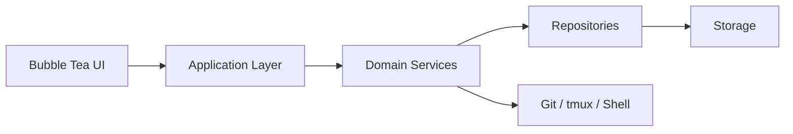
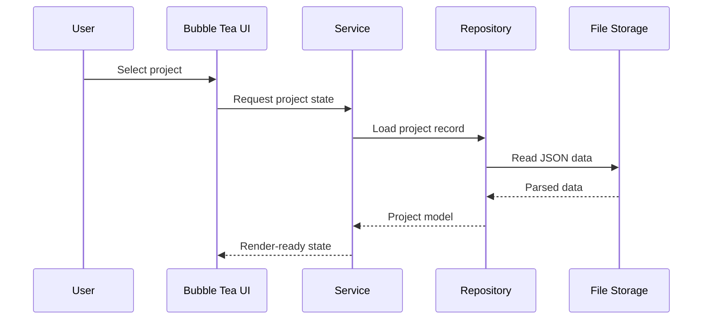

# DevFlow Workspace Orchestrator


DevFlow is a terminal-first workspace manager that unifies project registration, command execution, tmux sessions, Git inspection, and workflow orchestration in a single Bubble Tea application.

It is built as a local-first tool for organizing development environments from the terminal, with explicit separation between UI, services, repositories, and storage.

## Architecture At A Glance





## What DevFlow Solves

Modern development work is fragmented across terminals, Git, tmux, editors, and scripts. DevFlow centralizes the common workspace actions in one interface.

With DevFlow, you can:

- Register and organize local projects in a persistent registry
- Launch predefined commands per project
- Inspect Git status and repository metadata
- Restore and manage tmux sessions
- Search projects by name, stack, tags, and favorites
- Keep workspace preferences in a simple configuration system

## Current Scope

Status is tracked in detail in [docs/system-design.md](docs/system-design.md#implementation-status); the summary below reflects that table.

### Project Registry — Done

Store project metadata such as name, description, local path, stack, tags, favorite status, Git support, saved commands, and timestamps. Implemented in `internal/project`. `Service.AddProject` rejects registering a second project at a path that's already registered, so the same directory can't end up as two ambiguous registry entries.

### Command Runner — Done

Save and execute project commands like `go test ./...`, `npm run dev`, or `make migrate`, with streamed output captured per process. Implemented in `internal/runner`.

### Docker Awareness — Done

Detects whether a project has a `Dockerfile` or docker-compose setup, derives a Docker identifier for scoping CLI queries (Compose's own project-name convention, or a manual override for plain-`Dockerfile` projects), generates default docker/compose commands (`up`, `down`, `build`, `restart`, `logs`, or `build`/`run` without compose), and inspects that project's containers and images. Implemented in `internal/docker`, executed through `internal/runner`, and built on the `internal/shellexec` CLI abstraction. The dashboard view for this is not built yet — that lands with the Bubble Tea UI.

### Git Integration — Done

Reads current branch, working tree status (staged/unstaged/untracked counts, a clean flag), ahead/behind tracking, and recent commit history, by parsing `git status --porcelain=v2 --branch` and `git log --oneline` directly (no Git library dependency). Implemented in `internal/git`, built on `internal/shellexec`. The dashboard view for this is not built yet — that lands with the Bubble Tea UI.

### tmux Integration — Done

Creates, lists, and kills tmux sessions per project, and checks whether one already exists, by invoking the `tmux` CLI. Implemented in `internal/tmux`, built on `internal/shellexec`. Interactively attaching to a session hands the real terminal over to the tmux client for the session's lifetime, which the capture-based executor abstraction cannot represent — `tmux.AttachArgs` returns the literal command for the future application/UI layer to exec directly against the terminal, once that layer exists.

### Application Layer — Done

The composition root wiring project, docker, git, and tmux together, plus the cross-domain operations no single domain package should perform itself: registering a project and auto-detecting its Docker setup in one call, aggregating a project's live Git status and Docker containers/images into one read, and routing a saved command to the right executor regardless of which domain it belongs to. Implemented in `internal/app`; `cmd/devflow` now runs through it end to end instead of wiring services by hand.

### Interactive Dashboard & Search — Partial

`cmd/devflow` is now the real Bubble Tea entrypoint: a splash screen shows a purple-to-yellow gradient block-letter "DEVFLOW" banner (`internal/ui/banner`), a tagline, and — once the terminal is large enough — a distinctly-designed, named, static block-art mascot in each of the four corners: GitMaster (git), Dockzilla (docker), PaneMan (tmux), and ProjectPal (projects), each with its own shape and color, then hands off on keypress to the project dashboard (`internal/ui/dashboard`): the same gradient DEVFLOW wordmark (`theme.BrandGradientFrom`/`theme.BrandGradientTo`, the colors promoted out of `internal/ui/splash` so both screens render an identical logo) as a small masthead above a single bordered panel, centered in the terminal, showing a subtitle, every registered project (favorite marker in `theme.Accent`, tech-stack tags in `theme.Primary`, path, Docker badge), and a keybinding legend at the bottom — `↑/k ↓/j` navigate, `a` add, `e` edit, `f` toggle favorite, `d` delete (with a y/n confirmation prompt) — rendered via `theme.KeyHints` so the screen is self-explanatory without a separate help page, and always visible: a delete confirmation or a transient status ("deleted ...") appears as an extra line above the legend rather than replacing it. An empty registry shows "No projects yet" with the same "a add a project" hint rather than a bare blank list. Adding and editing a project both go through `internal/ui/projectform` (add and edit share one screen, since they differ only in how they start and how they save): adding is a two-step panel built on `charmbracelet/bubbles` (recolored to the app's own violet/yellow palette instead of the library's defaults) — step 1 is a directory picker (`bubbles/filepicker`) to browse to and choose the project's path (`s` to choose the current directory, since the picker's own DirAllowed mode conflates "open" and "select" on the same key), step 2 is a name/description/tags form (`bubbles/textinput`) before registering it via `app.AddProject`; editing skips straight to that same form, prefilled from the selected project (whose path can't be changed here), and saves over it via `UpdateProject` — preserving every field the form doesn't expose (favorite status, Docker detection, saved commands) rather than wiping them. Both screens are wired to `project.Service` directly. `enter` on a project opens `internal/ui/detail`, its full detail view, laid out as a sidebar of sections (Overview, Commands, Git, Docker) next to a content pane showing only the one currently selected — `←/→`, `h/l`, or `tab`/`shift+tab` switch between them — instead of stacking every section in one long scroll that could run past a smaller terminal's height and push a later section, Docker in particular, invisibly off the bottom. Overview shows the project's static fields. Commands lists its saved commands, selectable with `↑/k ↓/j`, with `a` to add one (a small name/command form) and `d` to delete the selected one (y/n confirmation) — persisted the same way projectform's edits are, by copying the project, mutating just the changed part, and calling `UpdateProject`. Git and Docker are fetched asynchronously via `app.ProjectContext` so the screen doesn't block while it shells out: Git shows branch, clean/dirty status with staged/unstaged/untracked counts, and ahead/behind; Docker shows containers (colored by running state) and images when the project has Docker configured, or an explanatory message in its place when it doesn't. The sidebar itself doubles as an always-visible index of what the screen offers and how to reach it, and the footer's keybinding legend changes to match whichever section is active, so it never advertises a key that wouldn't currently do anything. Implemented as independent, swappable screen packages under `internal/ui` (see `internal/ui/screen`'s `Screen` interface) sharing a common `internal/ui/theme` style palette — `theme.Primary` (violet) and `theme.Accent` (yellow) match the splash's banner gradient, and `theme.Panel`/`theme.PanelStyle` give every data/form screen the same bordered-panel look, width-capped to the actual terminal so it can't overflow a narrow one. Still pending: actually running a saved command with streamed output (the detail view can list/add/delete commands, not execute them yet), search/filtering, and a tmux session view.

### Configuration and Persistence — Partial

JSON storage and a compact YAML config file are in place (`internal/config`); theme/shell/editor preferences are not yet surfaced.

## Technology Stack

- Go for concurrency, portability, and a small runtime footprint
- Bubble Tea for event-driven terminal UI state management
- Lip Gloss for styling, borders, layout, and responsive components
- YAML (`gopkg.in/yaml.v3`) for configuration loading
- JSON for persistence

## Code Tree

DevFlow is organized domain-first: each capability (`project`, and soon
`docker`, `git`, `tmux`) owns its model, logic, and tests in one package,
rather than being split across generic `models/`/`services/`/`storage/`
layers. See [docs/architecture.md](docs/architecture.md) for the full
rationale.

```text
cmd/
	devflow/
		main.go

internal/
	config/                 # shared infra: YAML config loading
		config.go
		config_test.go
	runner/                 # shared infra: tracked shell process execution
		runner.go
		runner_test.go
	shellexec/              # shared infra: CLI executor abstraction (docker/git/tmux)
		executor.go
		executor_test.go
		fake.go
		fake_test.go
	project/                # domain: registry, commands, validation, storage
		commands.go
		models.go
		repository.go
		service.go
		storage.go
		validator.go
	docker/                 # domain: detection, default commands, container/image inspection
		detector.go
		detector_test.go
		inspector.go
		inspector_test.go
		model.go
		service.go
		service_test.go
	git/                    # domain: branch, status, ahead/behind, recent commits
		model.go
		service.go
		service_test.go
	tmux/                   # domain: session create/list/kill/attach
		model.go
		service.go
		service_test.go
	app/                    # composition root: wires domains, cross-domain orchestration
		app.go
		command.go
		context.go
		project.go
	ui/                     # Bubble Tea terminal interface (the real entrypoint)
		root.go
		ui.go
		screen/              # Screen interface every view implements
		theme/               # shared color tokens and base styles
		banner/              # block-letter text renderer (the splash banner)
		splash/              # startup screen
		dashboard/           # project list screen
		projectform/         # add/edit-project screen (directory picker + form)
		detail/              # project detail screen (commands, Git, Docker)
	data/
		projects.json       # local runtime project registry (not seed data)

devflow.png
devflow.yaml
README.md
LICENSE
docs/
	system-design.md
	architecture.md
```

## Documentation

The detailed design and architecture notes live in the docs folder:

- [System Design](docs/system-design.md)
- [Architecture](docs/architecture.md)

## Principles

- Terminal-first UX
- Local-first storage
- Modular architecture
- Separation of UI and business logic
- Service-oriented internal modules
- Extensible, plugin-ready design
- Explicit error handling
- Lightweight runtime
- Cross-platform compatibility

## License

DevFlow is released under the MIT License. See [LICENSE](LICENSE) for details.
