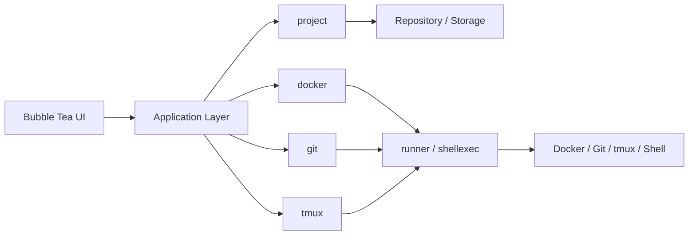

# Architecture

This document describes DevFlow's actual package structure and the way its
major parts communicate. It supersedes the layered structure originally
sketched here; that structure was never implemented and the codebase
converged on a different, better-fitting shape instead (see
[Domain-First, Not Layered](#domain-first-not-layered) below).

## High-Level View

```text
Bubble Tea UI
    -> Application Layer (internal/app)
        -> Domain Services (project, docker, git, tmux)
            -> Repository / Storage (JSON today; SQLite is a possible later phase)

Domain services also invoke the local operating system for Git, tmux, and
Docker CLIs, and shell commands in general, through shared infrastructure
packages (runner, shellexec) rather than calling os/exec directly.
```



## Domain-First, Not Layered

DevFlow organizes code by **domain** (project, docker, git, tmux), not by
**technical layer** (a top-level `models/`, a top-level `storage/`, a
top-level `services/`). Each domain package owns everything specific to
that concern — its model, its persistence or CLI access, its business
rules, and its tests — in one directory.

This was a deliberate choice, made explicit when the Docker, Git, and tmux
integrations were planned, for three reasons:

1. **It matches what was already built.** `internal/project` already
   bundles its model, repository interface, JSON storage implementation,
   service, validator, and command helpers together. Splitting those
   across top-level `models/`, `storage/`, `repository/`, `services/`
   packages (as originally sketched) would have meant undoing working,
   tested code rather than extending it.
2. **It avoids a well-known Go pitfall.** Generic layer packages named
   `models`, `services`, or `utils` tend to become dumping grounds with
   poor cohesion and are a common source of import cycles once enough
   domains exist. Package-by-feature is the more idiomatic Go layout for
   exactly this reason.
3. **It scales cleanly per capability.** Adding Docker awareness, for
   example, means adding one self-contained `internal/docker` package —
   not touching four different top-level layer directories. A contributor
   who wants to understand "everything about Docker integration" opens one
   directory.

Shared infrastructure that is *not* itself a domain concept — process
execution, CLI-command execution, and config loading — stays in its own
small package (`runner`, `shellexec`, `config`) rather than being folded
into a domain or a generic layer package. These are used *by* domains, but
don't belong to any single one.

## Domains and Shared Infrastructure

### Domain Packages

Each domain package is self-contained: model, service/business logic, and
(where relevant) persistence or CLI access all live together.

- **`internal/project`** — the project registry: `Project` and `Command`
  models, a `Repository` interface, a `JSONFileStorage` implementation,
  a `Service` that adds ID generation and validation, and command helpers.
- **`internal/docker`** — Docker/Compose awareness per project: detects
  whether a project has a `Dockerfile`/compose file, derives a project
  identifier for scoping `docker ps`/`docker images`, and executes
  docker/compose actions (via `runner`).
- **`internal/git`** — Git awareness per project: current branch, working
  tree status, ahead/behind, recent commits, read via the `git` CLI.
- **`internal/tmux`** — tmux session orchestration per project: create,
  restore, attach, and list sessions via the `tmux` CLI.

### Shared Infrastructure Packages

These are used by domain packages but hold no domain rules of their own.

- **`internal/config`** — loads `devflow.yaml` into typed settings
  (storage path, runner shell/timeout), with built-in defaults.
- **`internal/runner`** — starts and tracks long-running, streamed shell
  commands (used for both project commands and Docker actions like
  `docker compose up`).
- **`internal/shellexec`** — a small `Executor` interface over "run a CLI
  command, capture output," used for short-lived, parsed CLI calls
  (`git status`, `docker ps --format json`, `tmux list-sessions`). Kept
  separate from `runner` because those calls are queried synchronously for
  their output, not tracked as long-running processes. Having this as an
  interface (rather than calling `os/exec` directly from each domain) is
  what makes `docker`, `git`, and `tmux` unit-testable without those
  binaries actually being installed.

### Composition and Presentation

- **`internal/app`** — the composition root: wires domain services
  together, holds app-level state, and translates UI intent into calls
  across domains. This is the one place that is organized by role
  (orchestration) rather than by domain, because its entire job is to
  coordinate across domains.
- **`internal/ui`** — the Bubble Tea + Lip Gloss terminal interface:
  rendering, keyboard input, and view state, with no business logic of
  its own. Modular by construction: each top-level view (`splash`,
  `dashboard`, and whatever follows) is its own subpackage implementing a
  shared `Screen` interface (`internal/ui/screen`), so views are
  independently testable and swappable rather than one large model. The
  root `internal/ui` package owns only the `rootModel` that delegates to
  whichever `Screen` is currently active. `internal/ui/theme` holds the
  shared color tokens and base styles every screen renders from, and
  `internal/ui/banner` is a small standalone block-letter text renderer
  (used by `splash` for the startup banner).

## Recommended Repository Layout

```text
cmd/
    devflow/
        main.go

internal/
    config/
    shellexec/
    runner/

    project/
    docker/
    git/
    tmux/

    app/
    ui/
        screen/
        theme/
        banner/
        splash/
        dashboard/

assets/
scripts/
docs/
```

## Data Flow

1. The UI receives a user action.
2. The application layer (`internal/app`) translates that action into a
   call against one or more domain services.
3. A domain service performs the required business logic, invoking its own
   repository/storage (project) or the local OS via `runner`/`shellexec`
   (docker, git, tmux) as needed.
4. The application layer collects the updated state and returns it to the
   UI for rendering.

## Domain Model

```text
Workspace
├── Projects
│   ├── Commands
│   ├── Docker (containers, images, compose commands)
│   ├── Git (branch, status, commits)
│   └── Sessions (tmux)
├── Configuration
├── Runner
└── Storage
```

## Architecture Principles

- Terminal-first UX
- Local-first storage
- Domain-first module boundaries
- Separation of UI and business logic
- Explicit error handling
- Lightweight runtime
- Cross-platform compatibility
- Extensible, plugin-ready design
