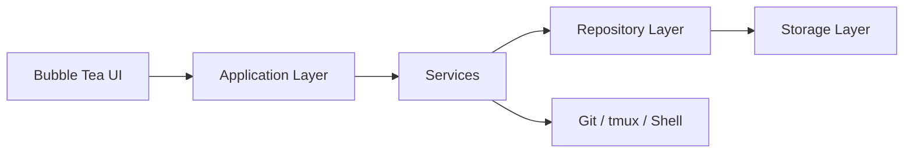

# Architecture

This document describes the intended layered structure of DevFlow and the way the major parts of the system should communicate.

## High-Level View

```text
Bubble Tea UI
    -> Application Layer
        -> Services
            -> Repository / Storage
                -> JSON or SQLite

Services also interact with the local operating system for Git, tmux, and shell commands.
```



## Layers

### Presentation Layer

The presentation layer is the terminal UI built with Bubble Tea and styled with Lip Gloss. Its responsibility is to:

- Render the dashboard and views
- Handle keyboard input and navigation
- Present state clearly and consistently
- Keep UI logic separate from business rules

### Application Layer

The application layer converts UI events into actions. It coordinates user intent, routes commands, and manages state transitions between screens or workflows.

### Service Layer

Services contain the main business logic. Each service owns a single domain concern and avoids direct UI dependencies.

Recommended service boundaries:

- Project service
- Command service
- Git service
- tmux service

### Repository Layer

Repositories provide structured access to persisted data. They should isolate the rest of the app from storage details and expose domain-oriented operations.

### Storage Layer

Storage is responsible for reading and writing persisted data. The current implementation uses JSON files.

### Operating System Integrations

The system interacts with local tooling where needed:

- Git CLI
- tmux CLI
- Shell processes

These integrations should stay behind service boundaries so they can be replaced or mocked cleanly.

## Recommended Repository Layout

```text
cmd/
    main.go

internal/
    app/
        app.go

    config/
    models/
    storage/
    repository/
    services/
        project
        command
        git
        tmux
    runner/
    ui/
    events/
    logger/
    utils/

assets/
scripts/
configs/
```

## Data Flow

1. The UI receives a user action.
2. The application layer translates that action into a domain command.
3. A service performs the required business logic.
4. The service may read or update persisted data through a repository.
5. The service may also invoke the local OS for Git, tmux, or shell work.
6. The updated state is returned to the UI for rendering.

## Domain Model

```text
Workspace
├── Projects
│   ├── Commands
│   ├── Git
│   ├── Sessions
│   └── Tags
├── Configuration
├── Runner
├── Logs
└── Storage
```

## Architecture Principles

- Terminal-first UX
- Local-first storage
- Modular boundaries
- Separation of UI and business logic
- Explicit error handling
- Lightweight runtime
- Cross-platform compatibility
- Extensible, plugin-ready design
