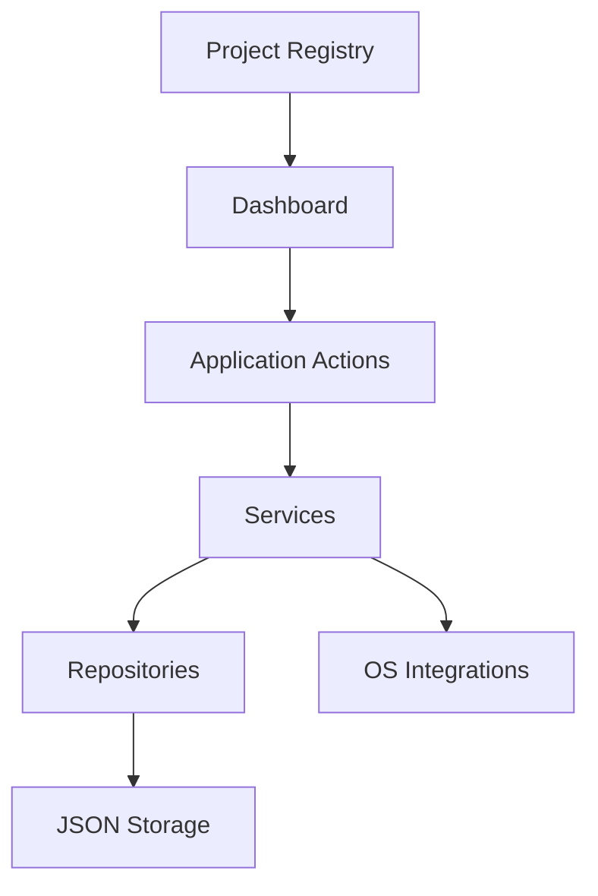

# System Design

DevFlow is a terminal-first workspace manager built to reduce context switching across projects, command execution, Git operations, tmux, and local developer tooling.

## System Overview

## Product Vision

DevFlow aims to become a lightweight developer operating system for the terminal. The application should be the first place a developer opens when starting work on a project.

## Problem Statement

Developers repeatedly perform the same setup tasks across many projects:

- Navigating into project directories
- Opening terminals
- Starting tmux sessions
- Running build and test commands
- Checking Git state
- Switching between repositories and shells

These actions are individually simple but collectively expensive. DevFlow reduces that cost by making them part of one structured workflow.

## Objectives

### Primary Goals

- Improve developer productivity
- Reduce context switching
- Standardize project workflows
- Simplify terminal-based development
- Provide reusable project automation
- Build production-quality systems software in Go

### Secondary Goals

- Learn and refine modular Go architecture
- Explore terminal UI patterns
- Support process and session orchestration
- Keep the implementation lightweight and cross-platform

## Core Functional Areas

### Implementation Status

This section is kept up to date at the end of each development phase so
the vision below stays distinguishable from what is actually built.

| Area                  | Status         | Notes                                                           |
| ---------------------- | -------------- | ---------------------------------------------------------------- |
| Project Registry       | Done           | `internal/project` — model, JSON storage, service, validation.  |
| Command Execution      | Done           | `internal/runner` — tracked, streamed shell processes.           |
| Docker Awareness       | Done           | `internal/docker` — detection, default commands, container/image inspection, via `internal/shellexec`. |
| Git Awareness          | Done           | `internal/git` — branch, status, staged/unstaged/untracked counts, ahead/behind, recent commits, via `internal/shellexec`. |
| tmux Coordination      | Done           | `internal/tmux` — create/list/kill sessions, existence check, via `internal/shellexec`. Interactive attach is a documented app/UI-layer concern (see AttachArgs), not something the capture-based executor can perform. |
| Application Layer      | Done           | `internal/app` — composition root wiring all four domains; cross-domain project registration (with Docker auto-detection), project context aggregation (Git + Docker in one read), and command routing. `cmd/devflow` now runs through it end to end. |
| Interactive Dashboard  | Partial        | `internal/ui` is the real entrypoint now: a splash screen (block-letter DEVFLOW banner) hands off to a centered, bordered-panel project dashboard (favorite marker, tech stack, path, Docker badge, and a full styled keybinding legend), with favorite-toggle, delete, and add-project (a directory picker + form, via `charmbracelet/bubbles`, recolored to the app's palette) wired to `project.Service`. Still pending: editing an existing project, a project detail view (Git status, commands, Docker containers/images), command output streaming, and a tmux session view. |
| Search and Filtering   | Not started    | Depends on the dashboard.                                        |
| Configuration          | Partial        | `internal/config` loads storage/runner settings; theme/shell/editor preferences not yet surfaced. |

### Project Registry

The registry is the source of truth for all managed projects. Each record can store:

- Name
- Description
- Local path
- Stack or technology labels
- Tags
- Favorite status
- Git support
- Docker support
- Saved commands
- Creation and update timestamps

### Dashboard

The dashboard presents a clear terminal interface for browsing registered projects and seeing relevant context, including:

- Name and description
- Stack or tags
- Git branch and status
- Favorite marker
- Recently opened state

### Command Execution

Each project can define reusable commands such as:

- `go run .`
- `go test ./...`
- `npm run dev`
- `make migrate`

Commands should run in a way that preserves streamed output and gives clear feedback inside the terminal UI.

### Docker Awareness

Projects that use Docker should be recognized automatically and get a
dedicated way to run and inspect their containers without leaving DevFlow.

- Detect whether a project has a `Dockerfile` and/or a docker-compose file
  (`docker-compose.yml`/`.yaml`, `compose.yml`/`.yaml`).
- Derive a project identifier for scoping Docker CLI calls: the
  docker-compose project name convention when a compose file is present,
  with a manual identifier field on the project as an override or as the
  fallback for plain-`Dockerfile` projects.
- Provide default, editable Docker commands once Docker is detected (e.g.
  `up`, `down`, `build`, `restart`, `logs`), run the same way project
  commands are — through the shared command runner.
- A container/image view scoped to the project: list its running and
  stopped containers and its images, filtered by the project's Docker
  identifier so unrelated containers on the machine don't clutter the
  view.

### Git Awareness

Git integration should provide repository insight without requiring the user to leave DevFlow. Initial coverage should include:

- Current branch
- Working tree status
- Recent commits
- Ahead/behind tracking

### tmux Coordination

tmux acts as the workspace engine for session restoration and layout management.

Core capabilities include:

- Creating sessions
- Restoring sessions
- Attaching to sessions
- Managing panes and layouts

### Search and Filtering

Projects should be searchable by:

- Name
- Technology
- Tags

Useful filters include:

- Favorites
- Recently opened projects
- Go projects
- Dockerized projects

### Configuration

Configuration should store user preferences such as:

- Theme
- Shell
- Editor

## Persistence Strategy

### Phase 1: JSON

JSON storage is the initial persistence layer because it is:

- Simple
- Human-readable
- Dependency-light
- Easy to inspect and modify

## Operating Model

DevFlow is designed around a local-first model:

1. Load configuration and registry data.
2. Render the dashboard in the terminal UI.
3. Accept user interaction through keyboard-driven navigation.
4. Dispatch actions to services for projects, commands, Git, tmux, or storage.
5. Persist changes back to the storage layer.

## Non-Functional Requirements

- Fast startup
- Small memory footprint
- Cross-platform compatibility
- Explicit error handling
- Clear separation of concerns
- Minimal external dependencies
- Stable terminal UX
