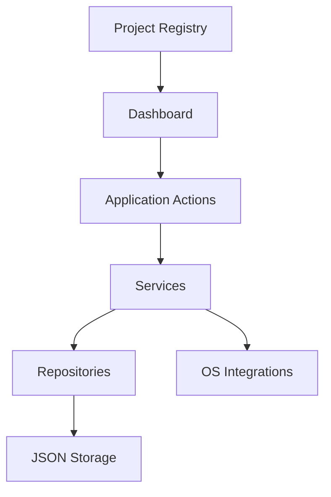

# System Design

DevFlow is a terminal-first workspace manager built to reduce context switching across projects, command execution, Git operations, tmux, and local developer tooling.

## System Overview

## Product Vision

DevFlow aims to become a lightweight developer operating system for the terminal. The application should be the first place a developer opens when starting work on a project.

## Problem Statement

Developers repeatedly perform the same setup tasks across many projects:

- Navigating into project directories
- Opening terminals
- Starting tmux sessions
- Running build and test commands
- Checking Git state
- Switching between repositories and shells

These actions are individually simple but collectively expensive. DevFlow reduces that cost by making them part of one structured workflow.

## Objectives

### Primary Goals

- Improve developer productivity
- Reduce context switching
- Standardize project workflows
- Simplify terminal-based development
- Provide reusable project automation
- Build production-quality systems software in Go

### Secondary Goals

- Learn and refine modular Go architecture
- Explore terminal UI patterns
- Support process and session orchestration
- Keep the implementation lightweight and cross-platform

## Core Functional Areas

### Project Registry

The registry is the source of truth for all managed projects. Each record can store:

- Name
- Description
- Local path
- Stack or technology labels
- Tags
- Favorite status
- Git support
- Docker support
- Saved commands
- Creation and update timestamps

### Dashboard

The dashboard presents a clear terminal interface for browsing registered projects and seeing relevant context, including:

- Name and description
- Stack or tags
- Git branch and status
- Favorite marker
- Recently opened state

### Command Execution

Each project can define reusable commands such as:

- `go run .`
- `go test ./...`
- `npm run dev`
- `make migrate`

Commands should run in a way that preserves streamed output and gives clear feedback inside the terminal UI.

### Git Awareness

Git integration should provide repository insight without requiring the user to leave DevFlow. Initial coverage should include:

- Current branch
- Working tree status
- Recent commits
- Ahead/behind tracking

### tmux Coordination

tmux acts as the workspace engine for session restoration and layout management.

Core capabilities include:

- Creating sessions
- Restoring sessions
- Attaching to sessions
- Managing panes and layouts

### Search and Filtering

Projects should be searchable by:

- Name
- Technology
- Tags

Useful filters include:

- Favorites
- Recently opened projects
- Go projects
- Dockerized projects

### Configuration

Configuration should store user preferences such as:

- Theme
- Shell
- Editor

## Persistence Strategy

### Phase 1: JSON

JSON storage is the initial persistence layer because it is:

- Simple
- Human-readable
- Dependency-light
- Easy to inspect and modify

## Operating Model

DevFlow is designed around a local-first model:

1. Load configuration and registry data.
2. Render the dashboard in the terminal UI.
3. Accept user interaction through keyboard-driven navigation.
4. Dispatch actions to services for projects, commands, Git, tmux, or storage.
5. Persist changes back to the storage layer.

## Non-Functional Requirements

- Fast startup
- Small memory footprint
- Cross-platform compatibility
- Explicit error handling
- Clear separation of concerns
- Minimal external dependencies
- Stable terminal UX
